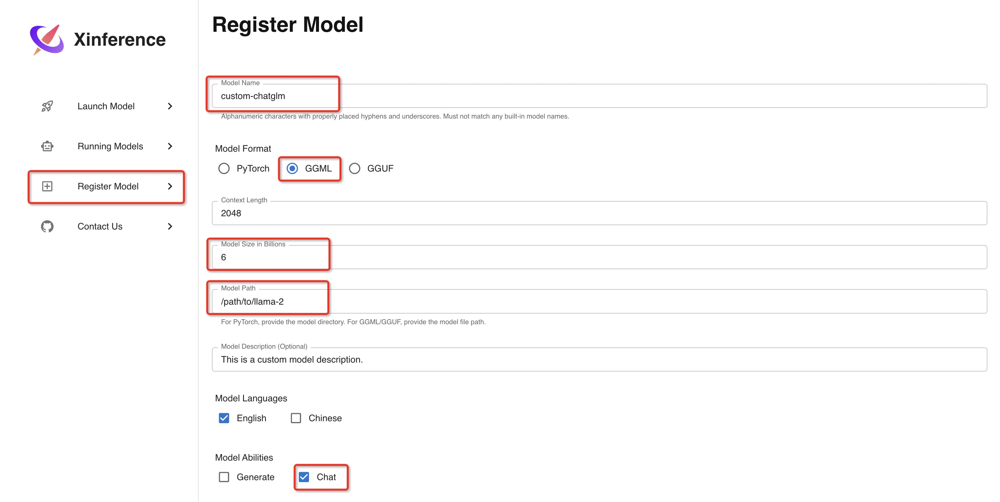

# 部署

经过训练的模型可以使用各开源推理框架进行部署。下面介绍SWIFT框架如何对接开源推理框架进行部署。

## VLLM

[VLLM](https://github.com/vllm-project/vllm) 是针对transformer结构的推理加速框架，支持的Paged Attention和Continuous Batching等技术可以有效提升推理效率并减低显存占用。

使用VLLM的条件为：

1. 使用全参数微调或LoRA微调
2. 模型类型符合VLLM支持的模型类型

目前VLLM支持的模型系列为：

> - Aquila & Aquila2 (`BAAI/AquilaChat2-7B`, `BAAI/AquilaChat2-34B`, `BAAI/Aquila-7B`, `BAAI/AquilaChat-7B`, etc.)
> - Baichuan (`baichuan-inc/Baichuan-7B`, `baichuan-inc/Baichuan-13B-Chat`, etc.)
> - BLOOM (`bigscience/bloom`, `bigscience/bloomz`, etc.)
> - Falcon (`tiiuae/falcon-7b`, `tiiuae/falcon-40b`, `tiiuae/falcon-rw-7b`, etc.)
> - GPT-2 (`gpt2`, `gpt2-xl`, etc.)
> - GPT BigCode (`bigcode/starcoder`, `bigcode/gpt_bigcode-santacoder`, etc.)
> - GPT-J (`EleutherAI/gpt-j-6b`, `nomic-ai/gpt4all-j`, etc.)
> - GPT-NeoX (`EleutherAI/gpt-neox-20b`, `databricks/dolly-v2-12b`, `stabilityai/stablelm-tuned-alpha-7b`, etc.)
> - InternLM (`internlm/internlm-7b`, `internlm/internlm-chat-7b`, etc.)
> - LLaMA & LLaMA-2 (`meta-llama/Llama-2-70b-hf`, `lmsys/vicuna-13b-v1.3`, `young-geng/koala`, `openlm-research/open_llama_13b`, etc.)
> - Mistral (`mistralai/Mistral-7B-v0.1`, `mistralai/Mistral-7B-Instruct-v0.1`, etc.)
> - MPT (`mosaicml/mpt-7b`, `mosaicml/mpt-30b`, etc.)
> - OPT (`facebook/opt-66b`, `facebook/opt-iml-max-30b`, etc.)
> - Qwen (`Qwen/Qwen-7B`, `Qwen/Qwen-7B-Chat`, etc.)

首先需要安装vllm:

```shell
pip install vllm
```

如果是全参数微调，则可以使用vllm直接启动API服务，方法如下：

```shell
python -m vllm.entrypoints.openai.api_server --model /dir/to/your/trained/model --trust-remote-code
```

如果是LoRA微调，需要先执行下面的脚本将LoRA weights合并到原始模型中：

```shell
# 先将文件夹cd到swift根目录中
python tools/merge_lora_weights_to_model.py --model_id_or_path /dir/to/your/base/model --model_revision master --ckpt_dir /dir/to/your/lora/model
```

合并后的模型会输出到`{ckpt_dir}-merged`文件夹中, 将该文件夹传入上述vllm命令中即可拉起服务。

调用服务：

```shell
curl http://localhost:8000/v1/completions \
-H "Content-Type: application/json" \
-d '{
"model": "/dir/to/your/trained/model",
"prompt": "San Francisco is a",
"max_tokens": 7,
"temperature": 0
}'

# Response:
{"id":"cmpl-90329ab1eba24d02934b38f2edbb26a8","object":"text_completion","created":11506341,"model":"/dir/to/your/trained/model","choices":[{"index":0,"text":" city in the United States of America","logprobs":null,"finish_reason":"length"}],"usage":{"prompt_tokens":4,"total_tokens":11,"completion_tokens":7}}
```

vllm也支持使用python代码拉起模型并调用，具体可以查看[vllm官方文档](https://vllm.readthedocs.io/en/latest/getting_started/quickstart.html)。

## chatglm.cpp

该推理优化框架支持：

ChatGLM系列模型

BaiChuan系列模型

CodeGeeX系列模型

chatglm.cpp的github地址是：https://github.com/li-plus/chatglm.cpp

首先初始化对应repo:
```shell
git clone --recursive https://github.com/li-plus/chatglm.cpp.git && cd chatglm.cpp
python3 -m pip install torch tabulate tqdm transformers accelerate sentencepiece
cmake -B build
cmake --build build -j --config Release
```

如果SWIFT训练的是LoRA模型，需要将LoRA weights合并到原始模型中去：

```shell
# 先将文件夹cd到swift根目录中
python tools/merge_lora_weights_to_model.py --model_id_or_path /dir/to/your/base/model --model_revision master --ckpt_dir /dir/to/your/lora/model
```

合并后的模型会输出到`{ckpt_dir}-merged`文件夹中。

之后将上述合并后的`{ckpt_dir}-merged`的模型weights转为cpp支持的bin文件：

```shell
# 先将文件夹cd到chatglm.cpp根目录中
python3 chatglm_cpp/convert.py -i {ckpt_dir}-merged -t f16 -o chatglm-ggml.bin
```

chatglm.cpp支持以各种精度转换模型，详情请参考：https://github.com/li-plus/chatglm.cpp#getting-started

之后就可以拉起模型推理：

```shell
./build/bin/main -m chatglm-ggml.bin -p 我想找个地 方游玩 --top_p 0.8 --temp 0.8

#好的，我为您总结了五个游玩的目的地，每个目的地都对应了一段合适的游玩推荐语，供您参考
#
#1. 主题公园：北京迪士尼度假区
#推荐语：
#
#来北京，不去迪士尼，怎么行？带上你的家人和朋友们，来北京迪士尼度假区，开启一场奇幻的冒险之旅！
#
#2. 历史遗址：秦始皇兵马俑
#推荐语：
#
#秦始皇兵马俑，中国历史上的一件重要文物，是中国古代文化宝库中的一颗璀璨明珠。在这里，你可以感受到秦朝的强大和威严，同时也可以感受到中国古代文化的深厚和悠久。
#
#3. 风景名胜：黄山
#推荐语：
#
#黄山，中国的五岳之一，位于安徽省黄山市。在这里，你可以欣赏到绝美的山水风光，感受到大自然的神奇魅力。同时，你也可以在这里感受到中华民族深厚的文化底蕴和丰富的精神世界。
#
#4. 自然景观：九寨沟
#推荐语：
#
#九寨沟，中国四川省阿坝藏族羌族自治州九寨沟县境内，位于岷山山麓，是中国著名的风景名胜区和世界自然遗产地。在这里，你可以欣赏到绝美的山水风光，感受到大自然的神奇魅力。同时，你也可以在这里感受到中华民族深厚的文化底蕴和丰富的精神世界。
#
#5. 文化古迹：西安城墙
#推荐语：
#
#西安城墙，位于陕西省西安市，是中国著名的古代城池之一。在这里，你可以感受到中国古代城市建筑的雄伟和壮丽，同时也可以感受到中华民族深厚的文化底蕴和丰富的精神世界。
```

## XInference

XInference是XOrbits开源的推理框架，支持大多数LLM模型的python格式和cpp格式高效推理。github链接在：https://github.com/xorbitsai/inference，在使用chatglm.cpp转换成ggml格式之后就可以使用XInference进行推理。

首先安装依赖：

```shell
# xinference使用了chatglm.cpp的pipeline推理能力，因此需要依赖chatglm.cpp
pip install git+https://github.com/li-plus/chatglm.cpp.git@main
pip install xinference -U
```

之后启动xinference：

```shell
xinference -p 9997
```

在浏览器界面上选择Register Model选项卡，添加chatglm.cpp章节中转换成功的ggml模型：



注意：

- 模型能力选择Chat

之后再Launch Model中搜索刚刚创建的模型名称，点击火箭标识运行即可使用。

调用可以使用如下代码：

```python
from xinference.client import Client

client = Client("http://localhost:9997")
model_uid = client.launch_model(model_name="custom-chatglm")
model = client.get_model(model_uid)

chat_history = []
prompt = "What is the largest animal?"
model.chat(
    prompt,
    chat_history,
    generate_config={"max_tokens": 1024}
)
# {'id': 'chatcmpl-df3c2c28-f8bc-4e79-9c99-2ae3950fd459', 'object': 'chat.completion', 'created': 1699367362, 'model': '021c2b74-7d7a-11ee-b1aa-ead073d837c1', 'choices': [{'index': 0, 'message': {'role': 'assistant', 'content': "According to records kept by the Guinness World Records, the largest animal in the world is the Blue Whale, specifically, the Right and Left Whales, which were both caught off the coast of Newfoundland. The two whales measured a length of 105.63 meters, or approximately 346 feet long, and had a corresponding body weight of 203,980 pounds, or approximately 101 tons. It's important to note that this was an extremely rare event and the whales that size don't commonly occur."}, 'finish_reason': None}], 'usage': {'prompt_tokens': -1, 'completion_tokens': -1, 'total_tokens': -1}}
```
