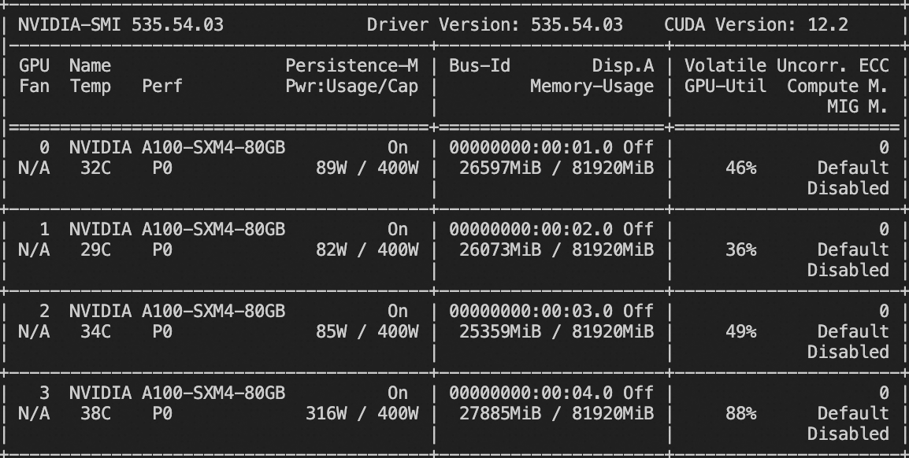
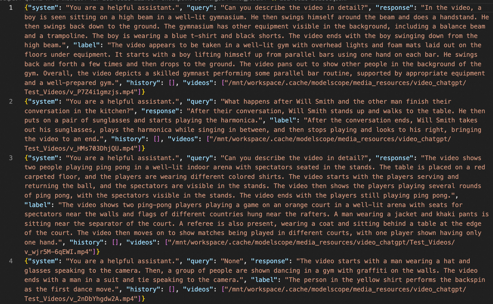

# Qwen2-VL 最佳实践

## 目录
- [环境准备](#环境准备)
- [推理](#推理)
- [微调](#微调)


## 环境准备
```shell
git clone https://github.com/modelscope/swift.git
cd swift
pip install -e .[llm]

# 请关注这个ISSUE: https://github.com/QwenLM/Qwen2-VL/issues/12
# pip install torch>=2.4
pip install git+https://github.com/huggingface/transformers.git
pip install pyav qwen_vl_utils
```

模型：
- qwen2-vl-2b-instruct: [https://modelscope.cn/models/qwen/Qwen2-VL-2B-Instruct](https://modelscope.cn/models/qwen/Qwen2-VL-2B-Instruct)
- qwen2-vl-7b-instruct: [https://modelscope.cn/models/qwen/Qwen2-VL-7B-Instruct](https://modelscope.cn/models/qwen/Qwen2-VL-7B-Instruct)


## 推理

推理qwen2-vl-7b-instruct:
```shell
# Experimental environment: A100
# 30GB GPU memory
CUDA_VISIBLE_DEVICES=0 swift infer --model_type qwen2-vl-7b-instruct
```

输出: (支持传入本地路径或URL)
```python
"""
<<< 你是谁？
我是来自阿里云的大规模语言模型，我叫通义千问。
--------------------------------------------------
<<< <image><image>这两张图片有什么区别
Input an image path or URL <<< http://modelscope-open.oss-cn-hangzhou.aliyuncs.com/images/cat.png
Input an image path or URL <<< http://modelscope-open.oss-cn-hangzhou.aliyuncs.com/images/animal.png
[INFO:swift] Setting size_factor: 28. You can adjust this hyperparameter through the environment variable: `SIZE_FACTOR`.
[INFO:swift] Setting resized_height: None. You can adjust this hyperparameter through the environment variable: `RESIZED_HEIGHT`.
[INFO:swift] Setting resized_width: None. You can adjust this hyperparameter through the environment variable: `RESIZED_WIDTH`.
[INFO:swift] Setting min_pixels: 3136. You can adjust this hyperparameter through the environment variable: `MIN_PIXELS`.
[INFO:swift] Setting max_pixels: 12845056. You can adjust this hyperparameter through the environment variable: `MAX_PIXELS`.
这两张图片的内容确实不同。第一张图片是一只小猫的特写，它有着大大的眼睛和柔软的毛发，显得非常可爱。第二张图片是一群羊的卡通插画，背景是绿色的草地和山脉，显得非常温馨和自然。
--------------------------------------------------
<<< <image>图中有几只羊
Input an image path or URL <<< http://modelscope-open.oss-cn-hangzhou.aliyuncs.com/images/animal.png
图中有四只羊。
--------------------------------------------------
<<< <image>计算结果是多少
Input an image path or URL <<< http://modelscope-open.oss-cn-hangzhou.aliyuncs.com/images/math.png
1452 + 45304 = 46756
--------------------------------------------------
<<< <image>对图片进行OCR
Input an image path or URL <<< http://modelscope-open.oss-cn-hangzhou.aliyuncs.com/images/ocr.png
图片中的文字内容如下：

简介

SWIFT支持250+ LLM和35+ MLLM（多模态大模型）的训练、推理、
评测和部署。开发者可以直接将我们的框架应用到自己的Research和
生产环境中，实现模型训练评测到应用的完整链路。我们除支持了
PEFT提供的轻量训练方案外，也提供了一个完整的Adapters库以支持
最新的训练技术，如NEFTune、LoRA+、LLaMA-PRO等，这个适配器
库可以脱离训练脚本直接使用在自己的自定流程中。

为方便不熟悉深度学习的用户使用，我们提供了一个Gradio的web-ui用
于控制训练和推理，并提供了配套的深度学习课程和最佳实践供新手入
门。

此外，我们也在拓展其他模态的能力，目前我们支持了AnimateDiff的
全参数训练和LoRA训练。

SWIFT具有丰富的文档体系，如有使用问题请查看这里.

可以在Huggingface space 和 ModelScope创空间 中体验SWIFT web-ui功能了。
--------------------------------------------------
<<< clear
<<< <video>描述视频
Input a video path or URL <<< https://modelscope-open.oss-cn-hangzhou.aliyuncs.com/images/baby.mp4
[INFO:swift] Setting nframes: None. You can adjust this hyperparameter through the environment variable: `NFRAMES`.
[INFO:swift] Setting fps: None. You can adjust this hyperparameter through the environment variable: `FPS`.
[INFO:swift] Setting size_factor: 2. You can adjust this hyperparameter through the environment variable: `SIZE_FACTOR`.
[INFO:swift] Setting min_frames: 4. You can adjust this hyperparameter through the environment variable: `MIN_FRAMES`.
[INFO:swift] Setting max_frames: 768. You can adjust this hyperparameter through the environment variable: `MAX_FRAMES`.
[INFO:swift] Setting min_pixels: 100352. You can adjust this hyperparameter through the environment variable: `MIN_PIXELS`.
[INFO:swift] Setting total_pixels: 19267584. You can adjust this hyperparameter through the environment variable: `TOTAL_PIXELS`.
[INFO:swift] Setting max_pixels: None. You can adjust this hyperparameter through the environment variable: `MAX_PIXELS`.
视频中展示了一个小孩在玩书。小孩穿着浅蓝色的背心和粉色的裤子，戴着一副黑色的眼镜，坐在床上，手里拿着一本打开的书。小孩先是用右手翻动书页，然后用左手扶着书，右手继续翻动书页。小孩的头发是浅色的，耳朵上戴着一个耳环。背景中可以看到一些衣物和家具。
"""
```

**单样本推理**

```python
import os
os.environ['CUDA_VISIBLE_DEVICES'] = '0'

from swift.llm import (
    get_model_tokenizer, get_template, inference, ModelType,
    get_default_template_type, inference_stream
)
from swift.utils import seed_everything
import torch

model_type = ModelType.qwen2_vl_7b_instruct
template_type = get_default_template_type(model_type)
print(f'template_type: {template_type}')

model, tokenizer = get_model_tokenizer(model_type, torch.bfloat16,
                                       model_kwargs={'device_map': 'auto'})
model.generation_config.max_new_tokens = 256
template = get_template(template_type, tokenizer)
seed_everything(42)

query = """http://modelscope-open.oss-cn-hangzhou.aliyuncs.com/images/road.png</img>距离各城市多远？"""
response, history = inference(model, template, query)
print(f'query: {query}')
print(f'response: {response}')

# 流式
query = '距离最远的城市是哪？'
gen = inference_stream(model, template, query, history)
print_idx = 0
print(f'query: {query}\nresponse: ', end='')
for response, history in gen:
    delta = response[print_idx:]
    print(delta, end='', flush=True)
    print_idx = len(response)
print()
print(f'history: {history}')

"""
template_type: qwen2-vl
query: http://modelscope-open.oss-cn-hangzhou.aliyuncs.com/images/road.png</img>距离各城市多远？
response: 根据图片中的路标，距离各城市的距离如下：

- 马踏：14公里
- 阳江：62公里
- 广州：293公里
query: 距离最远的城市是哪？
response: 距离最远的城市是广州，距离为293公里。
history: [['http://modelscope-open.oss-cn-hangzhou.aliyuncs.com/images/road.png</img>距离各城市多远？', '根据图片中的路标，距离各城市的距离如下：\n\n- 马踏：14公里\n- 阳江：62公里\n- 广州：293公里'], ['距离最远的城市是哪？', '距离最远的城市是广州，距离为293公里。']]
"""
```


## 微调

### 图像OCR微调
我们使用 latex-ocr-print 数据集进行微调，该数据集的任务是进行Latex OCR。您可以在 modelscope 上找到该数据集: [https://modelscope.cn/datasets/AI-ModelScope/LaTeX_OCR](https://modelscope.cn/datasets/AI-ModelScope/LaTeX_OCR)

```bash
# 单卡A10/3090可运行
# GPU Memory: 20GB
SIZE_FACTOR=8 MAX_PIXELS=602112 CUDA_VISIBLE_DEVICES=0 swift sft \
  --model_type qwen2-vl-7b-instruct \
  --model_id_or_path qwen/Qwen2-VL-7B-Instruct \
  --sft_type lora \
  --dataset latex-ocr-print#20000

# 全参数训练并freeze vit
# GPU Memory: 4 * 60GB
CUDA_VISIBLE_DEVICES=0,1,2,3 NPROC_PER_NODE=4 swift sft \
  --model_type qwen2-vl-7b-instruct \
  --model_id_or_path qwen/Qwen2-VL-7B-Instruct \
  --sft_type full \
  --freeze_vit true \
  --deepspeed default-zero2 \
  --dataset latex-ocr-print#20000
```

### 图像描述微调

我们使用 coco-en-mini 数据集进行微调，该数据集的任务是对图片内容进行描述。您可以在 modelscope 上找到该数据集: [https://modelscope.cn/datasets/modelscope/coco_2014_caption](https://modelscope.cn/datasets/modelscope/coco_2014_caption)

```bash
# 默认会将lora_target_modules设置为llm的所有linear
CUDA_VISIBLE_DEVICES=0,1,2,3 NPROC_PER_NODE=4 swift sft \
  --model_type qwen2-vl-7b-instruct \
  --model_id_or_path qwen/Qwen2-VL-7B-Instruct \
  --sft_type lora \
  --dataset coco-en-mini#20000 \
  --deepspeed default-zero2
```

如果要使用自定义数据集，只需按以下方式进行指定：
```bash
  --dataset train.jsonl \
  --val_dataset val.jsonl \
```

自定义数据集支持json和jsonl样式，以下是自定义数据集的样例：
```jsonl
{"query": "<image>55555", "response": "66666", "images": ["image_path"]}
{"query": "eeeee<image>eeeee<image>eeeee", "response": "fffff", "history": [], "images": ["image_path1", "image_path2"]}
{"query": "EEEEE", "response": "FFFFF", "history": [["query1", "response2"], ["query2", "response2"]], "images": []}
```

显存占用：


训练损失图（时间原因，只训练了200个step）：


微调后推理脚本如下：
```bash
CUDA_VISIBLE_DEVICES=0 swift infer \
    --ckpt_dir output/qwen2-vl-7b-instruct/vx-xxx/checkpoint-xxx \
    --load_dataset_config true --merge_lora true
```

微调后模型对验证集进行推理的示例：


### 图像grounding微调

我们使用refcoco-unofficial-grounding数据集进行grounding微调，您可以在 modelscope 上找到该数据集：https://modelscope.cn/datasets/swift/refcoco

```bash
# 支持使用zero3进行微调
CUDA_VISIBLE_DEVICES=0,1,2,3 NPROC_PER_NODE=4 swift sft \
  --model_type qwen2-vl-7b-instruct \
  --model_id_or_path qwen/Qwen2-VL-7B-Instruct \
  --sft_type lora \
  --dataset refcoco-unofficial-grounding#20000 \
  --deepspeed default-zero3
```

用户可以使用如下自定义数据集格式：
```jsonl
# swift跨模型通用格式
{"query": "Find <bbox>", "response": "<ref-object>", "images": ["/coco2014/train2014/COCO_train2014_000000001507.jpg"], "objects": "[{\"caption\": \"guy in red\", \"bbox\": [138, 136, 235, 359], \"bbox_type\": \"real\", \"image\": 0}]" }
{"query": "Find <ref-object>", "response": "<bbox>", "images": ["/coco2014/train2014/COCO_train2014_000000001507.jpg"], "objects": "[{\"caption\": \"guy in red\", \"bbox\": [138, 136, 235, 359], \"bbox_type\": \"real\", \"image\": 0}]" }
# qwen2-vl-chat特定格式，注意特殊字符的存在
{"query": "Find <|object_ref_start|>the man<|object_ref_end|>", "response": "<|box_start|>(123,235),(324,546)<|box_end|>", "images": ["/coco2014/train2014/COCO_train2014_000000001507.jpg"]}
```

### 视频微调

我们使用 video-chatgpt 数据集进行微调，该数据集的任务是对视频内容进行描述。您可以在 modelscope 上找到该数据集：https://modelscope.cn/datasets/swift/VideoChatGPT
```bash
NFRAMES=24 MAX_PIXELS=100352 CUDA_VISIBLE_DEVICES=0,1,2,3 NPROC_PER_NODE=4 swift sft \
  --model_type qwen2-vl-7b-instruct \
  --model_id_or_path qwen/Qwen2-VL-7B-Instruct \
  --sft_type lora \
  --dataset video-chatgpt \
  --deepspeed default-zero2
```

自定义数据集支持json和jsonl样式，以下是自定义数据集的样例：
```jsonl
{"query": "<video>55555", "response": "66666", "videos": ["video_path"]}
{"query": "eeeee<video>eeeee<video>eeeee", "response": "fffff", "history": [], "videos": ["video_path1", "video_path2"]}
{"query": "EEEEE", "response": "FFFFF", "history": [["query1", "response2"], ["query2", "response2"]], "videos": []}
```

显存占用：


微调后推理脚本如下：
```bash
NFRAMES=24 MAX_PIXELS=100352 CUDA_VISIBLE_DEVICES=0 swift infer \
    --ckpt_dir output/qwen2-vl-7b-instruct/vx-xxx/checkpoint-xxx \
    --load_dataset_config true --merge_lora true
```

微调后模型对验证集进行推理的示例（时间原因，只训练了50个step）：

